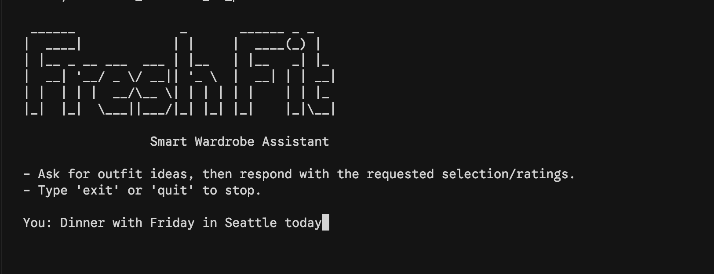

# FreshFit: Personal Outfit & Wardrobe Copilot

[](LICENSE)
[](#quickstart)
[](https://github.com/yourusername/freshfit/actions)

> **TL;DR**: FreshFit is a Gemini-powered CLI copilot that routes between styling advice (OutfitFlow) and wardrobe CRUD (Cloth Registrar) while pulling live weather, honoring rotation rules, and explaining every recommendation.

## Demo


<sub>*Left: OutfitFlow recommendation. Right: cloth registrar CRUD session.*</sub>

## Quickstart

```bash
git clone https://github.com/yourusername/freshfit.git
cd freshfit
python -m venv .venv && source .venv/bin/activate
pip install -r requirements.txt
cp .env.example .env  # add GOOGLE_API_KEY
python main.py
```

## Development Setup

Install the Git hooks so formatting, linting, and secret scans run before every commit:

```bash
pip install pre-commit
pre-commit install
pre-commit run --all-files  # optional, to validate the repo immediately
```

The hook set enforces Black, Ruff (lint + format), isort, and detect-secrets.

## 🚀 Features

### Intelligent Outfit Planning
- **Context-aware**: Retrieves live weather + occasion cues via Google Search.
- **Wardrobe rotation**: Surfaces unworn pieces before recent repeats.
- **Smart ranking**: Optimizes for color harmony, warmth, and your history.
- **Explainability**: Justifies each outfit (“The wool coat blocks the 12 °C wind...”).

### Wardrobe Management
- **Natural commands**: “Add this white linen shirt” or “Delete the scuffed boots.”
- **Image + text ingestion**: Extracts metadata even if you only upload a photo.
- **Validation**: Enforces controlled vocab for category, warmth, formality, and body zone.

### Feedback & Learning
- **Rating loop**: 1–5 star scores teach the ranking agent your taste.
- **Wear history**: Logs dates to avoid recommending the same look twice in a row.

## Usage Examples

### OutfitFlow styling request
```text
> Need something smart-casual for San Francisco tomorrow. Chance of rain?
✔ Weather agent: 58 °F, showers expected.
✔ Wardrobe cataloger: 6 candidates found.
→ OutfitFlow:
  1. Navy merino sweater, charcoal chinos, waterproof Chelsea boots.
  Why it works: Merino keeps you warm without overheating, boots handle the rain, palette stays office-friendly.
```
Tips:
- Mention **location/date** or “what’s the weather” and the agent will fetch conditions.
- Add **occasion keywords** (e.g., “gallery opening”) to bias the designer toward formality.
- Finish with “rate that outfit 3 stars” to feed the feedback learner.

### Cloth Registrar CRUD
```text
> Add this charcoal wool blazer (image upload)
Analyzer: detected outerwear / heavy / smart_casual
✔ Added item #92 “Charcoal Wool Blazer”

> Remove the red trail runners
Fetch: found 2 matches — “Red Trail Runner (ID 12)” and “Scarlet Runner (ID 37)”
User: delete ID 12
✔ Deleted item #12
```
Tips:
- Provide **photos or rich descriptions**; unspecified fields are inferred.
- When deleting by description, the registrar confirms matches before removal.

## System Overview

FreshFit is orchestrated by a Gemini router agent that chooses between two branches:
1. **OutfitFlow** – the reasoning-heavy styling pipeline.
2. **Cloth Registrar** – CRUD for wardrobe inventory (add/delete items).

Within OutfitFlow, weather enrichment and wardrobe filtering run in parallel, then a sequential chain (designer → preference ranking → explanation) produces the final response. Feedback ratings flow back into persistent history so the next run reflects your taste.

## Agent Graph

```mermaid
graph TD
    Router[Gemini Router]
    Router -->|Styling| OutfitFlow
    Router -->|CRUD| ClothRegistrar

    subgraph OutfitFlow
        Weather --> ParallelJoin
        WardrobeCataloger --> ParallelJoin
        ParallelJoin --> OutfitDesigner --> PreferenceRanking --> Explanation
        Explanation --> Feedback
    end

    subgraph ClothRegistrar
        ClothRegistrar --> ClothAdder
        ClothRegistrar --> ClothDeleter
    end
```

## Documentation

FreshFit ships with a MkDocs handbook in the `docs/` folder:
- `docs/index.md` – project overview + quickstart
- `docs/architecture.md` – deeper system diagrams and routing logic
- `docs/agents.md` – agent specs, prompts, tools, schemas
- `docs/prompts.md` – prompt templates, guardrails, retry policies
- `docs/configuration.md` – environment variables, API keys, local data layout
- `docs/PRD.md`, `docs/CLAUDE.md` – existing planning docs

Run the site locally:

```bash
pip install mkdocs mkdocs-material
mkdocs serve
```

## Contributing

We welcome PRs! Read the [CONTRIBUTING.md](CONTRIBUTING.md) guide for environment setup, code style, and test commands before opening an issue or PR.

## License

[MIT](LICENSE)