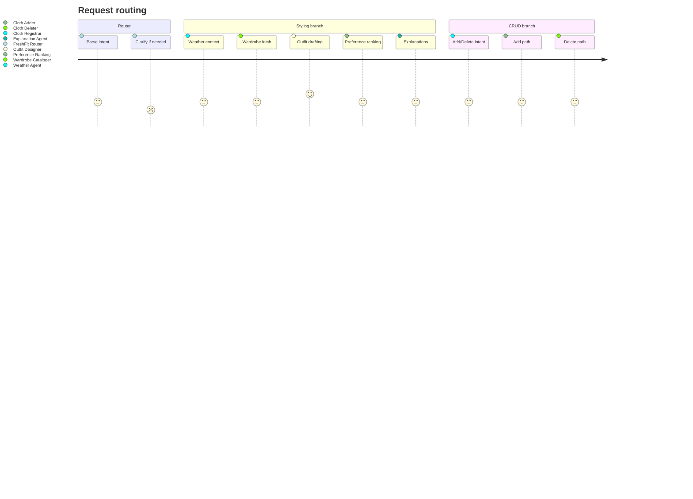

# Architecture

FreshFit stitches together a handful of ADK agents behind a Gemini router. This page zooms in on the execution graph, the two major flows, and how data travels between components.

## High-Level Routing

1. **FreshFit Router (`agents/router_agent.py`)**
   - Gemini `Agent` with instructions to choose between OutfitFlow (styling) and `cloth_registrar` (wardrobe CRUD).
   - Asks clarifying questions when intent is ambiguous.
2. **OutfitFlow (default branch)**
   - Parallel stage: `weather_agent` + `wardrobe_cataloger`.
   - Sequential stage: `outfit_designer` → `preference_ranking` → `explanation_agent`.
   - Feedback loop handled interactively in the CLI via `feedback_learning`.
3. **Cloth Registrar branch**
   - Router delegates to `cloth_adder` or `cloth_deleter` for CRUD requests.

## Data Flow

| Stage | Inputs | Outputs | Notes |
| --- | --- | --- | --- |
| Weather agent | location, date, occasion tag | temp bucket, °C stats, precip | Calls `date_tool` + `google_search`. |
| Wardrobe cataloger | user id, required categories | filtered wardrobe, summary | Pulls from SQLite via `demo_wardrobe_tool`, applies rotation rules. |
| Outfit designer | weather bundle, wardrobe items | ≥5 outfits w/ IDs, details | Never hallucinates clothing, enforces accessories/outerwear heuristics. |
| Preference ranking | outfit slate, history tool | ordered IDs, decision trace | Ensures mix of “loved combo” + “exploration” looks. |
| Explanation agent | outfits, weather context | CTA text plus rationales | Keeps tone positive; no raw JSON surfaced to the user. |
| Feedback learning | acceptance + ratings | normalized feedback, metrics events | Updates history and prompts user for missing data. |

## Storage & Tooling

- **SQLite (`data/demo_wardrobe.db`)** stores the demo closet accessed by wardrobe + registrar agents.
- **Tools (`tools/*.py`)** wrap database access, date helpers, preference history, etc.
- **CLI state** (recent outfits, ratings) is persisted via simple JSON/SQLite helpers inside `tools/`.

## Execution Surfaces

- **CLI (`main.py`)** is the canonical surface today.
- The ADK composition cleanly exposes agents, so adding a web or mobile surface only requires a different orchestrator front-end; the agent graph remains unchanged.

## Reliability Considerations

- Retry config is centralized (`types.HttpRetryOptions`) with exponential backoff for Gemini calls.
- Weather and wardrobe tooling surface explicit notes when falling back to stale data; downstream agents bubble that context up to the user.
- Preference ranking enforces diversity and explains when exploration overrides recency rules.

